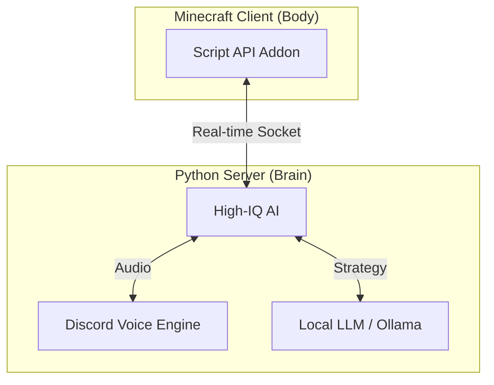

# AI-Minecraft: 次世代統合版サーバー革命
**〜アドオンを超えた「生命」がマイクラに宿る〜**

このプロジェクトは、マインクラフト統合版（Bedrock Edition）に**最先端のAI（人工知能）**と**Discord連携**を組み合わせ、従来の「コマンドの塊」だったワールドを「自律して動くゲーム体験」へと進化させるシステムです。

---

## 🚀 なぜこのシステムが「最強」なのか

他のアドオンやコマンドと決定的に違う点は、**「二重構造オーケストレーション」**にあります。

````carousel

<!-- slide -->
### 1. 「身体」はマイクラ、 「頭脳」は外部サーバー
マイクラの中だけでは不可能な「複雑な計算」や「大規模データ処理」を外部のPythonサーバーへ委譲。
これによって、サーバー本体への負荷をゼロにしつつ、数秒前までの会話や地形を覚えている**インテリジェンスなAI**を実現しました。

<!-- slide -->
### 2. Discordとの「完全同期」
Discordのボイスチャンネルとマイクラが繋がります。
AIがDiscordで喋り、プレイヤーの発言をマイクラのチャットに文字起こし。
ゲーム内の死神がDiscordのミュートを自動制御するなど、**Discordをコントローラーの一部**として使います。
````

---

## 🔥 主要機能（Feature Sets）

### 🤖 自律型 AI エンティティ
単に決まった動きをするBotではありません。
- **地形認識 (Voxel Sensing)**: 周囲のブロックを3Dスキャンして「どこから落ちたら死ぬか」「どこまで飛べるか」をリアルタイムに理解。
- **A* パルクール演算**: 障害物があっても、ジャンプやダッシュ、スニークを駆使して目的地へ最短で向かいます。
- **個性 (Personalities)**: LLM（大規模言語モデル）を搭載し、プレイヤーとの会話や役職に応じた戦略を自ら考えます。

### 📡 コンソール完全対応
「PCサーバーは入りにくい」という常識を壊します。
- **Xboxフレンド招待方式**: SwitchやPS5の友達も、指定のアカウントとフレンドになるだけで参加可能。
- **専用プロキシ**: 複雑なDNS設定なしで、誰でもスマホや家庭用ゲーム機から入れます。

### 🎭 次世代の観戦システム
- **ゴースト・スペクテーター**: 死亡後も透明な幽霊として世界を自由に歩き回れます。
- **TPカメラ**: Discordのボタン一つで、生存者の視点へ一瞬でテレポート。
- **霊界チャット**: 死者同士だけがDiscordとマイクラを跨いで戦略会議ができます。

---

## 🔧 資産を活かす「コンバーター」
今まで苦労して作ったコマンドブロックのワールドを無駄にしません。
- **Command Scanner**: ワールド内のコマンドブロックを一斉にスキャンし、Pythonプログラムへ**自動変換**して取り込む機能を搭載。
- **一括置換機能**: 何百ものコマンドの山を、シンプルで強力な一撃のプログラムへと昇華させます。

---

## 📈 未来へのビジョン
現在は「人狼ゲーム」をベースに開発していますが、このコアシステム（脳）を入れ替えるだけで、
- **村人と本格的に会話できるRPGサーバー**
- **AIが自動でアスレチックを作るサーバー**
- **永遠に終わらない、AIによる鬼ごっこ**
など、無限の可能性へ拡張できます。

---

> [!IMPORTANT]
> **「マイクラで、これやりたかった。」を形に。**
> あなたのクリエイティビティをAIで加速させます。
